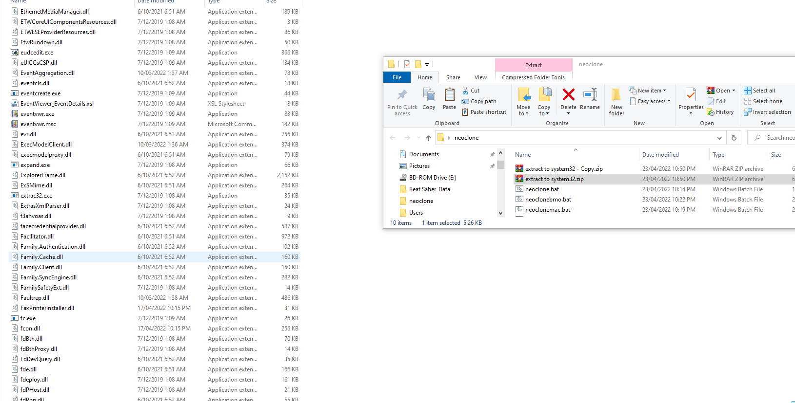
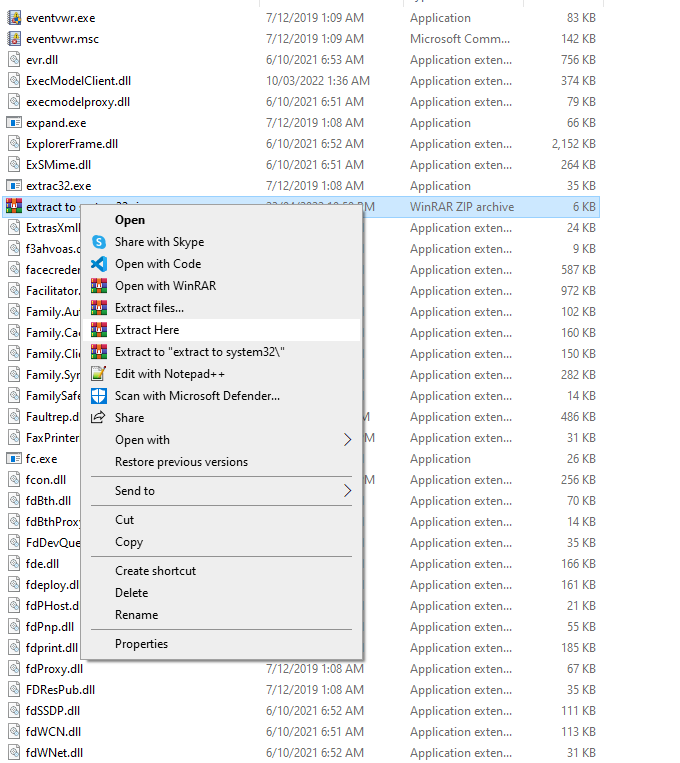

# Neoclone !
Neoclone Is a windows alternative to neofetch since you cant get it on windows
created by wk2poor 
__________________

How it works :
using batch windows files it  reads them through a command prompt with the batch file having a simple "menu" ( its just a little acsii and displays system info )
so if you just type "neoclone" into cmd it should show up with a neofetch reminisent sort of screen

____________________

please look at wiki for other neoclone commands

_____________________

steps for install ↓
                  

# first open system32 

# second drag "export to system32.zip" to system32

# third right click "export to system32.zip" then click "extract here"

